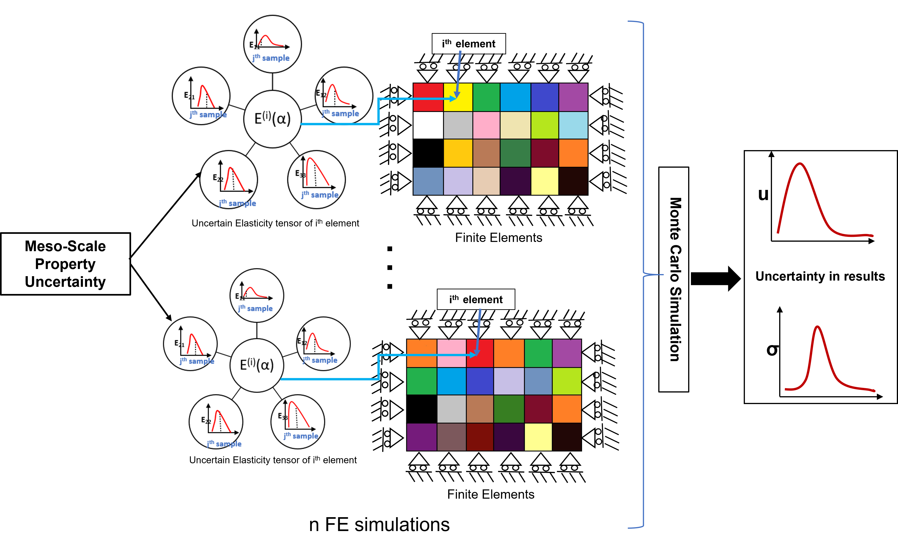

# Uncertainty Propagation from Meso to Macro-Scale in Aerospace Materials

This repository contains MATLAB code for finite element modeling (FEM) of a titanium-aluminum alloy (Ti-7Al), used to study uncertainty propagation from microstructural features to meso- and macro-scale mechanical properties. This work is essential for assessing the structural integrity and reliability of aerospace components, which are often subjected to inherent microstructural variations that impact their mechanical performance.

## Overview

The mechanical behavior of aerospace metals like Ti-7Al is affected by microstructural uncertainties, such as grain size and orientation, which propagate and impact properties at larger scales. This project involves:
1. **Microstructural Analysis:** Examining variations in elastic modulus and Poisson's ratio at the micro-scale.
2. **Finite Element Framework:** Incorporating these variations into a FEM model to simulate and analyze their effects on macroscopic properties.
3. **Monte Carlo Simulations:** Using probabilistic methods to study how meso-scale uncertainties affect deflections, stress distributions, and overall structural performance.

## Code Structure

The primary MATLAB code in this repository is designed to:
- Implement FEM for a transversely loaded square plate with variable microstructural properties.
- Sample elasticity tensor components for each element from a distribution derived from meso-scale data.
- Perform Monte Carlo simulations to generate distributions for displacement and stress values.

### Key Files
- **main_rect_w_stress.m**: The main FEM code, which incorporates stochastic properties to simulate stress and displacement distributions.
- **Additional .m files**: Supporting functions for FEM calculations, mesh generation, and probabilistic sampling.

## Dependencies
- MATLAB (any recent version supporting matrix operations and plotting).
- Statistics and Machine Learning Toolbox (recommended for Monte Carlo and statistical analysis).

## Results

The results of the simulations are validated against analytical solutions and compared with ANSYS results for accuracy. Sample outputs include:
1. Deflection and stress distributions under different boundary conditions.
2. Comparative histograms of maximum deflections and stresses under variable elasticity and Poisson’s ratio.

## How to Use

1. Clone this repository:
   ```bash
   git clone https://github.com/Astro-Lab-VT/UQ-propagation-from-meso-to-macro-scale.git
2. Run the main MATLAB file main_rect_w_stress.m to start the simulations. Adjust parameters in the script to change boundary conditions or material properties as needed.

## Paper Reference
For more details on the methodology and validation, please refer to the paper: Coming Soon
